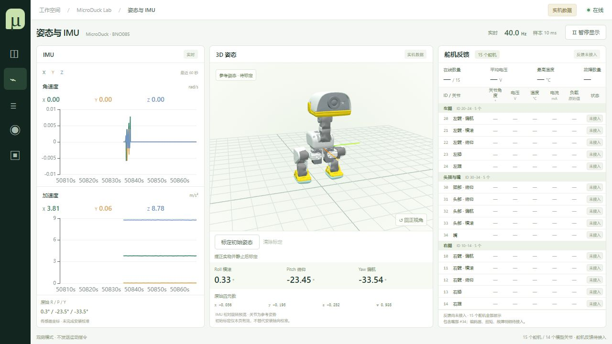

# MicroDuck Web 观测台 · 0.8.0



> BNO085 IMU + 15 个 HD-1910 舵机的观测与显式标定平台。主控共享标定、3D 姿态显示及 ONNX 影子推理验证，不发送运动控制指令。

前后端分离的机器人观测平台。支持电脑上的模拟后端和主控上的真实 BNO085 后端，不发送运动控制指令。

支持本地模拟调试与 Radxa ZERO 3W / BNO085 实机采集。前端使用 Vue 3、TypeScript、Three.js 和 ECharts，后端使用 FastAPI 与 WebSocket。

工作台按 IMU 30% / 3D 鸭子 40% / 15 个舵机 30% 单屏展示。部署见 [部署说明](deploy/README.md)。

已实现：机械模型身体朝向、四元数/欧拉角、IMU 三轴曲线、按级别/关键词筛选日志、JSONL 日志导出、暂停显示、自动重连、数据过期状态和异常模拟场景。

“姿态与 IMU”页已接入 15 个飞特 HD-1910 舵机的信息表，按左腿 20–24、头颈与嘴 30–34、右腿 10–14 分组。单屏表格展示原始编码器步数、电压、温度、电流、原始负载、在线状态，以及在线数量、平均电压、最高温度和故障数量汇总；协议同时提供扭矩状态、故障和样本年龄字段。配置串口后读取指定 ID 的编码器、电压、温度、原始电流、负载和状态；观测采集不发送运动或扭矩指令；硬件中位仅在标定页明确执行后写入。未配置 ID 显示“未接入”，配置后无应答显示“无应答”，超龄反馈不显示为实时数据。编码器未校准为关节角度，电流保留原始单位。15 个舵机均映射到模型关节，嘴部 ID 34 使用简化铰链模型。

未标定的鸭子关节保持模型参考姿势，已标定关节跟随真实编码器反馈。已支持当前安装的 −90° / 0° / +90° 轴向显示修正；支持多姿势安装轴向校准和 IMX219 WebRTC 视频；ToF 和完整遥测录制回放尚未实现。服务不会因浏览器断开而停止采集。

所有已接入的实时遥测（IMU、舵机、系统状态、日志）均通过 WebSocket 更新；HTTP 用于初始化元信息、历史查询、共享标定读写及调试操作。共享标定每 1.5 秒同步一次，实时遥测继续使用 WebSocket。舵机帧到达后立即应用，曲线仍独立限频。

## 当前验证状态

2026-09-23 在 Radxa 主控、15 个 HD-1910、1 Mbps 总线上完成只读采集测试：

| 指标 | 结果 |
|---|---:|
| 舵机源发布频率 | **49.36 Hz** |
| 15 个舵机整组扫描 P50 / P95 | 8.50 / 9.14 ms |
| 最老关节数据年龄 P95 / 最大值 | 30.53 / 41.05 ms |
| IMU 数据年龄 P95 | 39.46 ms |
| 30 秒测试 | 2,297 次快照请求无超时，1,453 组观测无缺失舵机回包 |

[完整测试结果与口径](docs/validation/20260923/README.md) · [最终测量 JSON](docs/validation/20260923/final-poller-benchmark.json)

7 个 ONNX 模型在主控 CPU 上完成合成输入基准，纯推理 P95 约 0.89–0.94 ms。**完整实时推理链路和实机运动尚未验证通过**：首轮真实输入存在越界与过期拦截，不能用合成输入耗时代替闭环验证。模型输出始终不连接舵机执行。

## 单颗舵机标定与模型联动

点击右侧表格中的关节名称，将实物摆到模型参考姿势，再点击“标定初始位置”。每颗舵机独立记录当前编码器步数，之后按 `(当前步数 - 基准步数) × 360 / 4096 × 方向` 驱动对应 3D 关节，保留多圈差值。若显示转向与实物相反，点击“方向”切换正负。默认方向为 −1，实际安装方向需逐颗核对。

这是页面显示标定，不是硬件归零，不写 EEPROM、不发送运动或扭矩指令。仅在线、新鲜、无故障且未暂停时可标定；反馈过期或离线时模型保持最后角度。清除后恢复参考姿势，零点与方向保存到后端主控文件，刷新、切换浏览器和后端重启后自动恢复；更换舵机、修改硬件偏移或多圈编码器重置后应重新标定。整体 IMU 姿态与关节转动独立叠加。

## IMU 安装方向、归零与重启恢复

首次使用时，将实物摆好并保持静止，等待在线且数据实时，点击“仰卧一键标定”，按模型摆好后勾选 IMU。当前四元数保存为显示参考，模型保留仰卧目标姿态；原始 R/P/Y 仍保留在 IMU 卡片底部。

“安装方向”支持 −90°、0°、+90°，当前已验证的躯干安装默认 −90°；换安装方式后必须核对前倾、左倾是否与模型一致。选择保存在主板，刷新、切换浏览器和服务重启后都可读取。

计算先取 `inverse(q_initial) * q_current`，再按安装方向转换旋转坐标系。此操作只修改显示参考，不写 IMU 或舵机硬件配置，也不测量空间位置。

重启后不再强制重新归零：

1. 自动恢复已保存的 IMU 参考用于显示，并提示“新会话待核对”。
2. 实物与模型方向一致时，点“确认沿用已存参考”；保留原四元数和标定时间，只确认当前会话。
3. 方向不一致、移动过 IMU 或参考已不可信时，摆正后重新标定。

当前驱动不能可靠识别所有 IMU 断电或内部重置，所以“恢复显示”不等于“确认可用于推理”。只读推理程序仍拒绝跨会话未确认的参考。未标定时实机模型保持参考姿态；离线、数据过期/无效或暂停时不能标定。暂停不会清除保存值。

## 启动

需要 Node.js 22.12+ 或 24、Python 3.11+。主控采集与推理实测环境为 Linux aarch64 / Python 3.13.5；下方为 Windows 本地开发示例。

在项目根目录打开两个终端：

```powershell
cd debug-server
python -m venv .venv
.venv/Scripts/python -m pip install -r requirements.txt
.venv/Scripts/python -m uvicorn server:app --host 127.0.0.1 --port 8877
```

```powershell
cd frontend
npm ci
npm run dev
```

浏览器打开 http://127.0.0.1:5173 。默认后端地址为 http://127.0.0.1:8877 。更换服务地址时先点“断开”，编辑地址后重新连接。Linux/macOS 的虚拟环境 Python 位于 `.venv/bin/python`。

两端分别 Ctrl+C 停止。使用其他后端端口时更改 uvicorn 的 `--port` 和页面地址即可。前端端口固定 5173，已占用时启动失败；如改前端端口，需要同时更新后端的 HTTP CORS 与 WebSocket Origin 允许列表。

上述命令默认启用模拟模式并监听本机；主控部署使用 `MICRODUCK_SOURCE=hardware`。生产构建自动连接页面所在主机，不会误连访问者电脑上的 127.0.0.1。主控服务面向可信局域网，未实现账户鉴权，不应转发到公网。网页资源和模型不依赖第三方 CDN。

## 页面与场景

- 默认进入“姿态与 IMU”单屏工作台：左侧角速度/加速度数值与双曲线，中间 3D 鸭子、标定和姿态数值，右侧全部 15 个舵机。随窗口高度伸缩，无需上下滚动；窄屏继续保持 IMU / 模型 / 舵机三栏。模型默认镜头为正面偏转 20°，“回正视角”恢复这一镜头。
- 总览：保留连接设置、3D、姿态读数、曲线和日志。
- 暂停显示：冻结身体朝向、数值和曲线，继续接收后台数据。日志的“暂停浏览”独立生效，恢复后显示缓存中的最新日志。
- 日志筛选支持级别和模块/消息关键词，最多缓存 5,000 条，页面显示最近 500 条匹配记录。导出包含当前浏览快照内全部匹配记录，最多 5,000 条。
- “IMU 停更”：停止产生姿态和 IMU 新样本，连接与服务心跳继续；500 ms 后延迟、1,500 ms 后过期。
- “无效姿态”：零范数四元数被标记无效，3D 保留最后有效朝向，数值显示 `—`。
- “组合姿态”恢复正常；“静止”返回单位四元数；“日志突发”产生 100 条模拟日志。
- 可停止/重启后端验证自动重连，新的 `bootId` 会清理旧时间轴。接收频率是浏览器实测值；模拟采样目标 50 Hz，实际受操作系统定时器和负载影响。

样本年龄按服务发送时的年龄加浏览器接收后时间估算，不包括未知网络单程延迟。IMU 和身体姿态分别维护新鲜度，心跳不会刷新传感器数据。

## 只读采集复测与模型推理

采集测量脚本只请求 HTTP 快照，不直接访问硬件。主控本机运行可排除电脑到机器人的网络波动：

```bash
python scripts/measure_observer_latency.py --endpoint http://127.0.0.1:8877 --seconds 30 --output /tmp/observer-latency.json
```

影子推理需独立环境安装 NumPy 和 ONNX Runtime，并自行提供带归一化器及 metadata 的模型目录，至少包含 `stand.onnx`。模型须符合 61 维观测、14 维动作约定；第 15 个嘴舵机不参与策略输入。

```bash
python scripts/shadow_policy.py --models /path/to/models --geometry frontend/public/model/model.json --endpoint http://127.0.0.1:8877 --seconds 30 --output /tmp/shadow-check
```

程序先测所有模型的合成输入耗时，再用真实输入运行站立模型；动作仅写入 `shadow.jsonl`，汇总保存到 `summary.json`。缺失/过期反馈、未确认的 IMU 参考、无法唯一换算的关节角度会拦截该帧。网页显示保留编码器多圈差值；影子推理仅在关节限位内存在唯一整圈等价角度时换算，并记录所选分支。当前速度使用位置差分估算，上一动作使用上一帧预测，不能代替执行反馈。

详见 [只读推理说明](docs/shadow-inference.md) 与 [已测依赖版本](docs/validation/20260923/requirements-installed.txt)。模型权重、环境和逐帧运行日志不随仓库提供。

## 检查

```powershell
cd frontend
npm test
npm run build
```

```powershell
cd debug-server
.venv/Scripts/python -m pip install -r requirements-dev.txt
.venv/Scripts/python -m unittest -v
```

已配置对应测试依赖的环境，也可在仓库根目录运行：

```bash
python -m unittest discover -s debug-server -p 'test_*.py'
PYTEST_DISABLE_PLUGIN_AUTOLOAD=1 python -m pytest tests/test_shadow_policy.py -q
npm --prefix frontend test
npm --prefix frontend run build
```

2026-09-23 提交前验证：后端 26 项、影子推理 8 项、前端 23 项，共 57 项通过，前端构建通过。

构建输出在 `frontend/dist/`；后端检测到构建目录后同时提供静态页面。开发时仍可独立启动 Vite 和 API 服务。

## 文件与接口

- `frontend/src/store.ts`：独立连接层、重连、主题缓存及新鲜度判断。
- `frontend/src/protocol.ts`：消息和四元数校验、坐标转换。
- `frontend/src/components/`：模型视图和曲线。
- `debug-server/server.py`：模拟源、最新快照、有界日志和网络接口。
- `debug-server/servos.py`：独立进程同步只读采集、回包校验、离线重试。
- `debug-server/calibrations.py`：共享标定持久化与并发版本检查。
- `scripts/`：采集延迟测量和 ONNX 只读推理。
- `docs/validation/20260923/`：分阶段现场测量结果与复测说明。
- `protocol/README.md`：v1 实际接口约定。
- `frontend/public/model/`：复用现有模型，附上游 Apache-2.0 许可证与来源说明。

后续机器人端实现相同观测接口即可复用前端；原始 IMU 必须完成安装方向校准后才能作为身体姿态。更多设计见 `protocol/README.md`。

## 舵机只读反馈

后端设置 `MICRODUCK_SERVO_PORT` 为 URT-2 串口路径即可启用，默认 1 Mbps、独立进程 SYNC_READ 批量只读、目标 50 Hz 采集和 WebSocket 推送上限，实际速率取决于串口响应与网络。离线 ID 每秒重试，避免每轮都等待超时。`MICRODUCK_SERVO_IDS` 默认为 `11,12,13,14,21,22,23,24`。留空串口配置时不访问舵机。配置示例见部署说明。可在页面逐颗标定显示参考零点，并检查旋转方向。

## 主控共享标定

标定通过 `GET/POST /api/v1/calibration` 保存及同步；写入携带 revision，检测并发修改，冲突时返回 409，避免覆盖其他页面的新标定。只改变显示参考，不写舵机参数。

systemd 部署保存到 `/var/lib/microduck-observer/calibration.json`，由 `StateDirectory` 创建持久目录；本地运行默认保存到 `~/.microduck-observer/calibration.json`，可通过 `MICRODUCK_CALIBRATION_FILE` 指定路径。升级已有部署时需要更新 service 并执行 daemon-reload、重启服务，使持久目录配置生效。保存使用临时文件替换并保留上一版本备份。

首次连接时，若主控尚无对应标定，可迁移当前浏览器的旧标定；主控已有数据时不会覆盖。IMU 旧标定仅在同一后端启动期间迁移。

## 姿势引导标定（0.8）

“姿态与 IMU”页模型下方的“仰卧一键标定”直接打开同页面板，成功保存后自动关闭并立即更新实时模型，无需刷新。默认使用仰卧躺平，一次采集舵机位置与 IMU；硬件中位可独立勾选。躯干背面放平、胸口朝上，各关节按模型零位对齐，头摆正、嘴闭合。仰卧姿势模型朝向为绕身体 Y 轴 −90°，保存时保留此目标朝向，不会把躺平的机器人显示为站立。其他折叠、分组和 IMU 多姿势流程收在高级选项。位置标定、硬件中位、IMU 可独立选择。目标模型仅用于手工摆姿势，绝不自动驱动实物。折叠参数沿用上游 servo-web 的 FOLD_CALIB：髋膝 ±1.57 rad、头颈摆正、嘴闭合；此参考不代表已验证适合每种机械装配。

1. 支撑机器人、按模型摆放；不便固定的关节先取消，分批补齐。
2. 一键采样约 1.3 秒，检查在线、新鲜度和位置稳定。IMU 额外检查角速度、重力模长和姿态稳定。
3. 查看每颗当前读数、目标、方向，确认后保存或写入。预览 60 秒失效，执行前再次采样；参数变化、故障、离线或并发修改会拒绝执行。

软件位置标定按目标姿势角度反算模型零位，不会把折叠姿势错误地当成全部 0°。硬件中位以 2048 为模型零位，折叠时写入的是 `2048 + 目标角度 × 4096/(2π) × 方向`，并同步更新显示参考。默认方向 −1 必须先按实物核对，单个静止姿势不能识别正反方向。

硬件校准仅允许已核对的 HD1910 固件 3.46、所选关节扭矩为 0、无故障且静止时执行。经原采集进程独占串口，备份原偏移、目标、锁状态及原显示标定后，使用 0x0B 校准指令；回读位置、偏移及锁定状态，不自动尝试偏移寄存器兜底，不自动重试不确定的写入。最后对齐目标寄存器到当前读数并锁定 EEPROM，不开扭矩、不发送运动目标。任一关节失败立即停止后续写入，并删除该关节不再可信的显示参考。成功关节保留结果。备份在标定文件同目录 `calibration-backups/`；故障恢复应依据备份单独检查，不盲目重复校准。

IMU 可以只做“躯干水平”初始参考；安装轴向校准再追加“右侧放 +90°（身体 +X）”“低头 +90°（身体 +Y）”两姿势。两个测得转轴必须近似正交，计算 sensor/body 旋转映射后用于 3D 姿态。保持同一朝向和会话，重新采集水平参考会清除旧轴向样本；重启后显示参考恢复；安装轴向追加采样仍须同一会话。该操作不估计位置，也不是传感器内部工厂校准，不能修复冻结或异常加速度。

开发验证使用模拟串口和数学测试；未自动对实物执行 EEPROM 写入或断电保持测试。


## 采集链路实现

串口独立进程隔离 IMU/Web 的 Python 调度干扰；一条 `SYNC_READ (0x82)` 读取 15 个 ID 的 40..70 寄存器，逐包校验 ID、长度和校验和。常规采集只发送 READ/SYNC_READ；显式硬件标定通过同一进程串行执行，不另开串口。参考飞特官方协议和本项目相邻 microduck-replica 的同步读实现。

每轮采集目标 20 ms；主进程每 10 ms 消费最新反馈，队列容量为 1，不累计旧帧。`joints.data` 增加 `scanMs`、`targetHz`、`readMode`；每行增加 `readMs`（同步请求发出至本 ID 回包解析的时间，不是单个 READ 往返时间）。离线 ID 每秒重试，缺失 ID 不会抹去其他 ID 的有效回包。关闭服务会停止并回收串口进程。

现场指标及各阶段对比见上方“当前验证状态”。主进程约 49 MB RSS，采集子进程约 14 MB RSS，另有 multiprocessing 资源管理进程；该数值为测试期间快照。网页可按自身显示频率订阅，页面刷新率不等于采集频率。

## 许可证

平台代码采用 [Apache-2.0](LICENSE)。随附模型保留其上游许可证及 [来源声明](frontend/public/model/NOTICE.md)。
